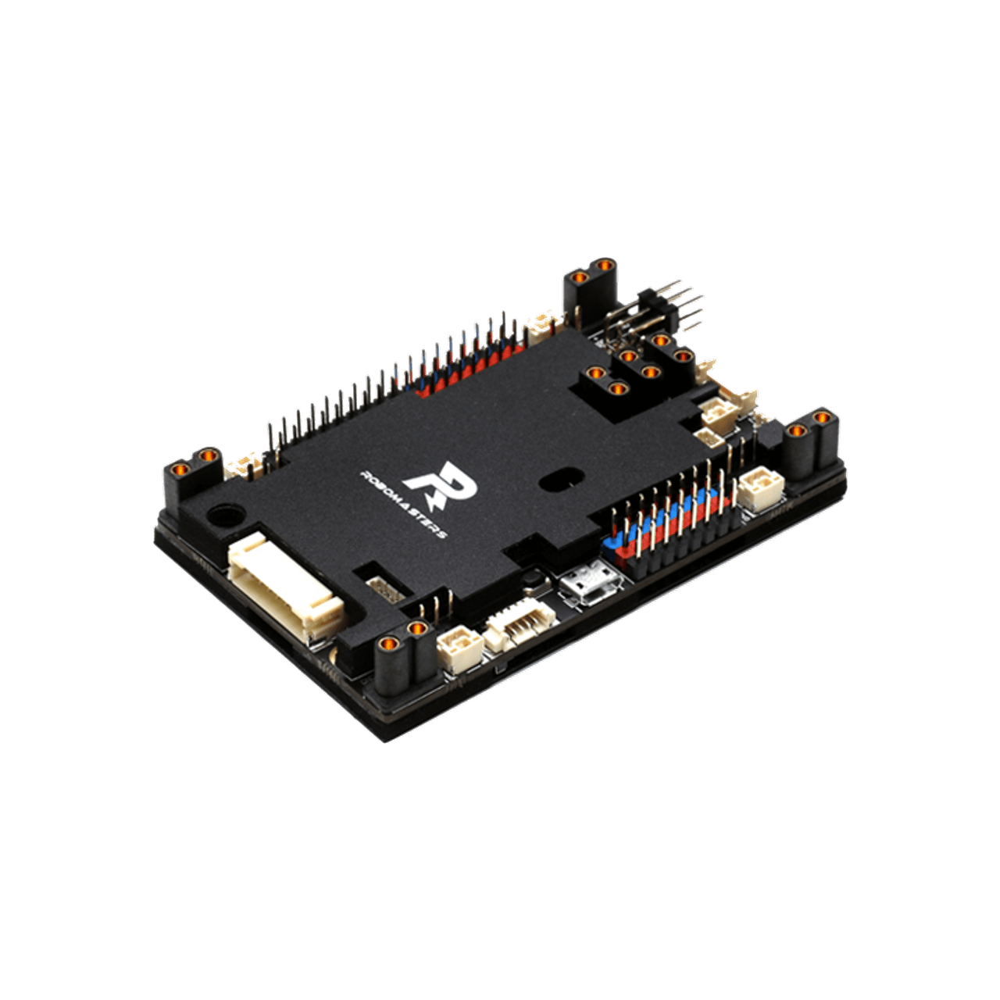

# RoboMaster 主控开发板（RM 开发板/2017版/信仰板/旧版）资料收集

此开发板大概是 DJI 教育开发套件中的板子，因为官方相关资料页面无法找到，资料很少

考虑到部分队伍仍有库存，故开此仓库共享资料

> 免责声明：
> 本文件系从公开渠道或第三方平台转载，仅供信息参考与交流学习之用，不代表我方（或本平台）对文件内容真实性、完整性、时效性、准确性的任何明示或默示的保证，亦不构成任何形式的法律、政策或操作建议。使用者应自行核实原始来源并审慎判断，因信赖或使用本文件内容而引致的任何直接、间接、附带的损失或纠纷，我方概不承担法律责任。本文件的版权归原始权利人所有，若涉及侵权或异议，请及时联系我们，我们将依法及时处理（如下架或修正）。凡以任何方式接触、查看或使用本文件者，均视为已自愿接受本免责声明的全部约束。感谢理解与配合。

## 这到底是什么板子？

区别于 A/B/C板，该开发板就称为 **RoboMaster 主控开发板** 或 **RM 开发板**，推测其在 2017 年推出 [商城链接](https://store.dji.com/cn/product/rm-main-controller-development-board) [官网链接](https://www.robomaster.com/zh-CN/products/components/general/development-board)

> RoboMaster 主控开发板（以下简称 RM 开发板）是一款专门为 RoboMaster 竞赛打造的机器人控制板，该开发板完全满足 RoboMaster 竞赛机器人控制需求。RM 开发板的主控芯片为 STM32F427，RM 开发板除了具备控制 RoboMaster 竞赛机器人的通用接口外，还包含 16 路 PWM 控制接口（含 5V 供电）、18 个用户自定义 IO 口、USB 接口、SD 卡接口和防反接电路等，用户可以在控制机器人的基础上，完成更复杂的自定义功能。IMU 部分做了隔离设计，含有温控电路，可以很大程度上解决 IMU 温飘的问题（需软件进行温度闭环处理）

相关文件本仓库下均有备份

## "官方"资料

- [RoboMasters主控开发板-开源资料.pdf](https://cdn-hz.robomaster.com/tem/RoboMasters%E4%B8%BB%E6%8E%A7%E5%BC%80%E5%8F%91%E6%9D%BF-%E5%BC%80%E6%BA%90%E8%B5%84%E6%96%99.pdf)
  - 通过 url 替换尝试可以找到 pdf 中的文件
  - [附件一: RM开发板-软件工程.zip](https://cdn-hz.robomaster.com/tem/RM%E5%BC%80%E5%8F%91%E6%9D%BF-%E8%BD%AF%E4%BB%B6%E5%B7%A5%E7%A8%8B.zip)
  - [附件二: RM开发板-硬件原理图.pdf](https://cdn-hz.robomaster.com/tem/RM%E5%BC%80%E5%8F%91%E6%9D%BF-%E7%A1%AC%E4%BB%B6%E5%8E%9F%E7%90%86%E5%9B%BE.pdf)
  - [附件三: RM开发板-用户手册.pdf](https://cdn-hz.robomaster.com/tem/RM%E5%BC%80%E5%8F%91%E6%9D%BF-%E7%94%A8%E6%88%B7%E6%89%8B%E5%86%8C.pdf)
- [例程: DevelopmentBoard-Examples](https://github.com/RoboMaster/DevelopmentBoard-Examples)

## GitHub 仓库资料

- https://openrobomaster.github.io/awesome-robomaster/README-CN.html
- https://github.com/FanmingL/NJURMaster/tree/master/NJURMaster/%E5%BC%80%E5%8F%91%E6%9D%BF%E6%96%87%E6%A1%A3
- https://github.com/Meta-Team/Datasheets/tree/master/RM%202017%20%E5%BC%80%E5%8F%91%E6%9D%BF
- https://github.com/eleboss/DJI_robomaster_car/tree/master
- https://github.com/swun-robomaster/robomaster-Master-Control-Board/tree/master
- https://github.com/swun-robomaster/main-control-panel/tree/master
- https://github.com/AlchemicRonin/-STM32-RoboMaster-/tree/master

## 一些碎碎念

本人多次在群中看到考古该资料的群u，故开此仓库

之前收集到某大学/战队公开网盘上有 RoboMaster 教育套件完整资料，可惜没保存链接，箬有找到的朋友欢迎贡献

这个板子应该是 RoboMaster 教育套件中的主控板，RoboMaster 教育套件中有若干传感器和例程，但因为某些未知原因中道崩殂

另外，DJI CDN 上大概还存有相关RoboMaster 教育套件文件，但之前的研究成果是需要一定权限才能查看，*有相关人脉的uu可以尝试贡献资料*

# 贡献

欢迎为此项目贡献资料/代码
**PR is welcome**
